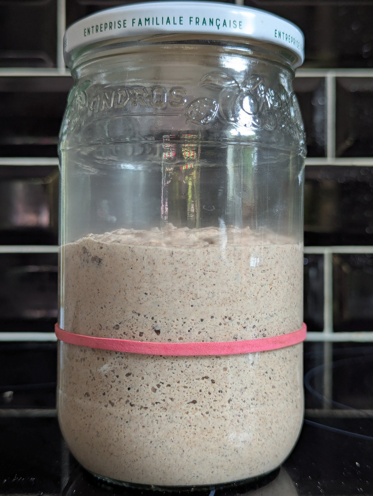

# Levain sans gluten

Conserver 60 g de levain chef au réfrigérateur. Chaque panification sert aussi
à renouveler ce chef, sans mélanger l'ancien levain de sécurité au nouveau.

## Rafraîchi pour la panification et renouvellement du chef

Toujours rafraîchir le levain avant de faire du pain. Ne pas prélever directement
les 200 g nécessaires dans le chef conservé au froid.

1. Garder 10 g des 60 g de chef au réfrigérateur comme sécurité temporaire.
2. Mélanger soigneusement les 50 g restants avec 105 g d'eau et 105 g de
   [mélange de farines](MixFarinesLevain.md). Ce rafraîchi de 260 g est proche
   d'un ratio 1:2:2, plus précisément 1:2,1:2,1.
3. Prélever immédiatement 60 g de ce mélange dans un bocal propre. Laisser la
   fermentation démarrer 30 à 60 minutes vers 24 °C, puis remettre ce nouveau
   chef au réfrigérateur.
4. Marquer le niveau des 200 g restants et les laisser fermenter vers 28 °C.
   Les utiliser pour le pain au voisinage du pic, éventuellement juste avant le
   maximum. Le volume et l'aspect du levain sont plus fiables qu'une durée fixe.
   Actuellement la durée typique observée est de 3-4h avec un vrai doublement.
5. Une fois le nouveau chef au réfrigérateur, utiliser les 10 g de sécurité dans
   une autre recette ou les jeter. Ne pas les réintroduire dans le nouveau chef.

Ce cycle conserve toujours 60 g de chef et fournit exactement les 200 g de
levain actif nécessaires au pain. L'utilisation près du pic favorise une
fermentation vigoureuse et limite l'acidité.

## Entretien sans panification

Si aucun pain n'est prévu pendant une semaine, rafraîchir le chef en 1:5:5 :
garder 10 g du chef au froid comme sécurité, puis mélanger 6 g du chef restant
avec 30 g d'eau et 30 g de mélange de farines. Conserver 60 g de ce nouveau
mélange, laisser la fermentation démarrer 30 à 60 minutes vers 24 °C, puis
remettre le bocal au réfrigérateur. Utiliser ou jeter les 6 g excédentaires et
l'ancien chef une fois le nouveau chef au froid.

## Avant une absence de plusieurs semaines

Faire un rafraîchi 1:8:8 afin que le levain dispose de suffisamment de farine.
Laisser la fermentation démarrer une heure vers 24 °C avant de le remettre au
réfrigérateur.

## Relance après plusieurs semaines au réfrigérateur

Faire deux ou trois rafraîchis 1:5:5 pour diluer l'acidité et relancer les
levures. Enchaîner chaque rafraîchi au pic ou peu après, sans attendre 24 heures
si le levain a déjà commencé à retomber.

## Dépannage

Un liquide en surface indique généralement que le levain a épuisé ses réserves
et doit être rafraîchi.

## Analyse nutritionnelle pour 100 g

Levain à 100 % d'hydratation, composé d'environ 50 % de farine et 50 % d'eau.
Le cycle de panification conserve cette proportion : le chef de départ contient
autant de farine que d'eau, auxquelles s'ajoutent 105 g de chaque.

* Énergie : 179 kcal
* Matières grasses : **1,7** g
  * dont acides gras saturés : **0,3** g
* Glucides : **36,7** g
  * dont sucres : **0,6** g
* Fibres : **2,9** g
* Protéines : **4,9** g
* Sel : **0** g
