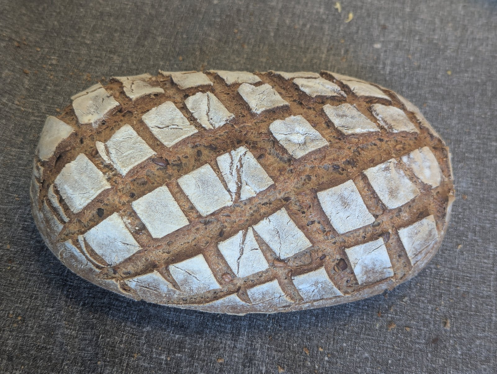

# Pain au levain sans gluten à la cocotte (≈1,0 kg cuit)

## Ingrédients (pâte crue ≈1259 g)

* 450 g d'eau environ, selon les farines utilisées
  (le pâton doit être très souple et assez collant - hydratation 92 %)
* [70 g de graines (mélanges lin, sésame, pavot, tournesol etc) - optionnel]
*  14 g psyllium blond
*   3 g gomme xanthane

* 200 g levain actif (≈40 % du poids des farines)
*  12 g huile d'olive

* 500 g [mélange farines/fécules pour pain](MixFarinesPain.md)
*  10 g sel

## Préparation (~ 10 h)

1. Suivre le [cycle de rafraîchi et de renouvellement du
   chef](../Levain/RecetteLevain.md) :
   50 g de chef, 105 g d'eau et 105 g de mix donnent 60 g de nouveau chef et
   200 g pour le pain. Utiliser ces 200 g au voisinage du pic, éventuellement
   juste avant le maximum.
2. [Optionel: le cas échéant, faire tremper les graines dans l'eau pendant que le levain fermente.]
3. Mélanger le psyllium et la gomme xanthane avec l'eau, puis laisser gélifier
   5 minutes.
4. Ajouter le levain et l'huile.
5. Ajouter le mélange de farines et fécules, puis le sel.
6. Façonner une boule bien lisse.
7. Laisser fermenter (pointage) 4 h à 28 °C, jusqu'à un gonflement d'environ
   50 %.
8. Fariner, scarifier et enfourner immédiatement dans la cocotte brûlante.

## Cuisson (55 min)

* Four et cocotte préchauffés 40 minutes à 240 °C
* Cuire 35 min couvercle fermé à 240 °C
* Poursuivre 20 min couvercle ouvert à 210 °C

Refroidir 4 h sur grille pour bien sécher la mie avant de couper.

## Analyse nutritionnelle pour 100 g

Pain cuit (~ 1259 g cru → ~ 979 g cuit, ~ 22 % d'évaporation).

* Énergie : 271 kcal
* Matières grasses : 6,0 g
  * dont acides gras saturés : 0,8 g
* Glucides : 48,8 g
  * dont sucres : 0,9 g
* Fibres : 5,2 g
* Protéines : 5,2 g
* Sel : 1,0 g
