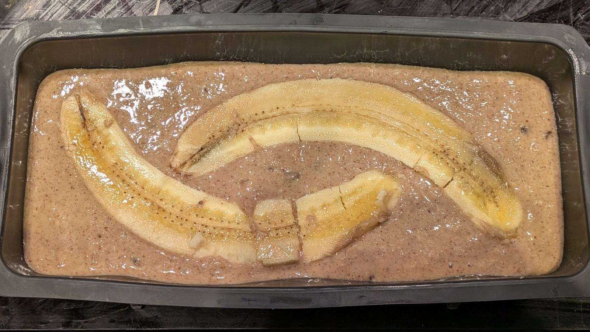
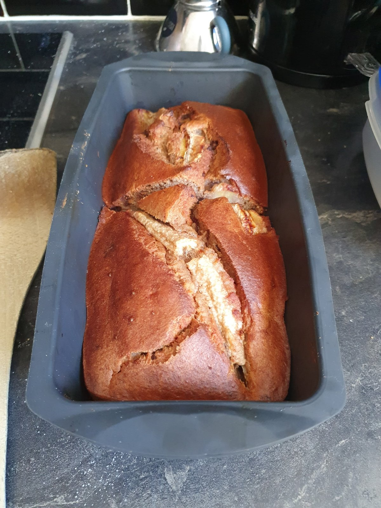

# Gâteau à la banane sans gluten (sans beurre)

*Variante avec beurre : [Gâteau à la banane](GateauBanane.md).*

Gâteau moelleux sans sucre raffiné ajouté : les bananes mûres apportent la
sucrosité, les amandes (poudre + purée) apportent gras doux, fibres et
protéines pour modérer l'indice glycémique. Mie aérée par la levure chimique
et les œufs entiers, parfumée à la cannelle et parsemée de pépites de chocolat.

* 4 bananes mûres écrasées (~ 440 g de chair) + 1 banane optionnelle coupée en deux pour la déco
* 150 g [mélange de farines patisserie](MixFarinesPatisserie.md)
*  80 g d'amandes en poudre
*  80 g de purée d'amandes
*  90 mL de lait
*   2 œufs
*   1 sachet de levure chimique
*  50 g de pépites de chocolat noir
*   1 c. à c. de cannelle (~ 2 g)
*   2 g de sel

# Préparation

1. Préchauffer le four à 180°C.
2. Écraser les 4 bananes à la fourchette dans un grand bol.
3. Mélanger les ingrédients secs (farines, amandes en poudre, cannelle, sel),
   en terminant par la levure chimique.
4. Ajouter la purée d'amandes, le lait et les œufs aux bananes écrasées,
   mélanger jusqu'à obtenir une base homogène.
5. Incorporer les secs progressivement, mélanger juste assez pour éviter les
   grumeaux.
6. Ajouter les pépites de chocolat, en garder quelques-unes pour la surface.
7. Verser dans un moule à cake chemisé.
8. Couper la 5ème banane en deux dans la longueur et la déposer sur le dessus
   (optionnel), parsemer du reste des pépites.

# Cuisson

* 50 minutes à 180°C dans un moule à cake.
* Vérifier la cuisson au couteau : il doit ressortir sec ou avec quelques
  miettes humides (les bananes apportent beaucoup d'eau).
* Laisser tiédir dans le moule avant démoulage, la mie se raffermit.

# Analyse nutritionnelle pour 100 g

Gâteau cuit, recette complète (pépites de chocolat noir, banane décorative
non comptée).

* Énergie : 265 kcal
* Matières grasses : 13,1 g
  * dont acides gras saturés : 2,3 g
* Glucides : 31,3 g
  * dont sucres : 10,6 g
* Fibres : 4,2 g
* Protéines : 7,8 g
* Sel : 0,40 g

# Notes

* Choisir des bananes bien mûres (peau tachetée) : plus sucrées et plus
  faciles à écraser, elles évitent d'ajouter du sucre.
* Pour une version plus protéinée : remplacer 20-30 g de farine par de la
  whey neutre, voir [Notes/AugmenterTauxProteines](../Notes/AugmenterTauxProteines.md).

## Atténuer le goût d'amande

La recette contient 160 g d'amandes (80 g poudre + 80 g purée) sur ~ 870 g
de pâte : l'arôme amande peut couvrir la banane. Plusieurs leviers, du plus
léger au plus radical :

* **Remplacer la purée d'amande par de la purée de cajou** (80 g) : profil
  gras et texture quasi identiques, mais goût beaucoup plus neutre. Solution
  la plus simple et la plus efficace.
* **Ou par 60 g de Skyr nature + 20 mL d'huile neutre** : abaisse les graisses
  et augmente les protéines, goût lacté discret qui s'efface derrière la
  banane.
* **Réduire la poudre d'amande à 40 g**, compensée par 40 g de
  [mélange farines patisserie](MixFarinesPatisserie.md)
  supplémentaire (texture un peu moins riche mais plus de banane).
* **Renforcer les arômes concurrents** plutôt qu'enlever l'amande :
  - 1 c. à c. d'extrait de vanille (ou 2 sachets de sucre vanillé en
    remplacement d'autant de farine),
  - 1 c. à s. de rhum brun (classique banane),
  - porter la cannelle à 3-4 g,
  - 50 → 80 g de pépites de chocolat noir.
* **Variante chocolat-banane** : pour une bascule complète, voir
  [Gâteau chocolat banane](GateauChocolatBananeSansBeurre.md), qui utilise
  les bananes comme source de sucrosité dans une base chocolat sans amande
  dominante.
