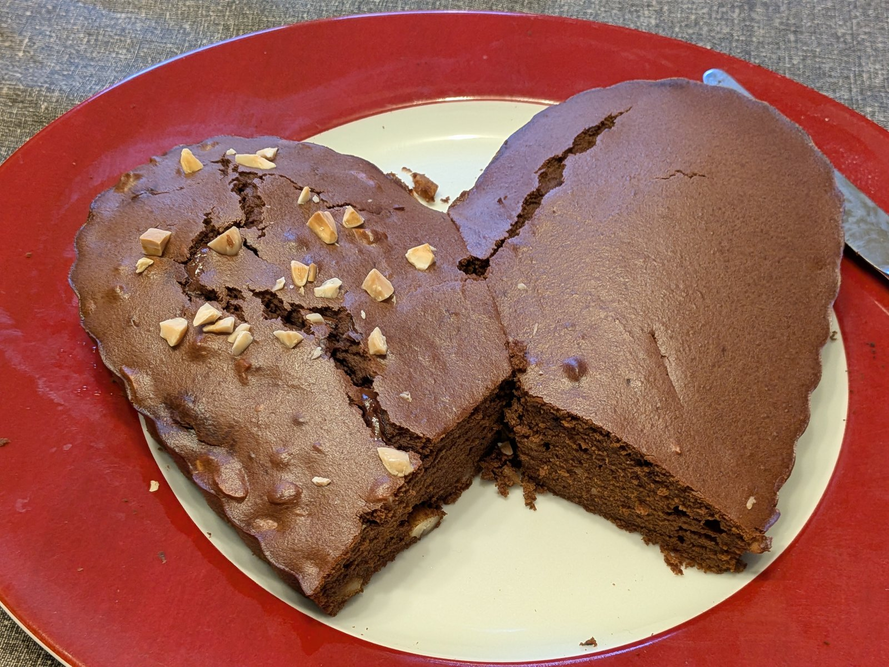
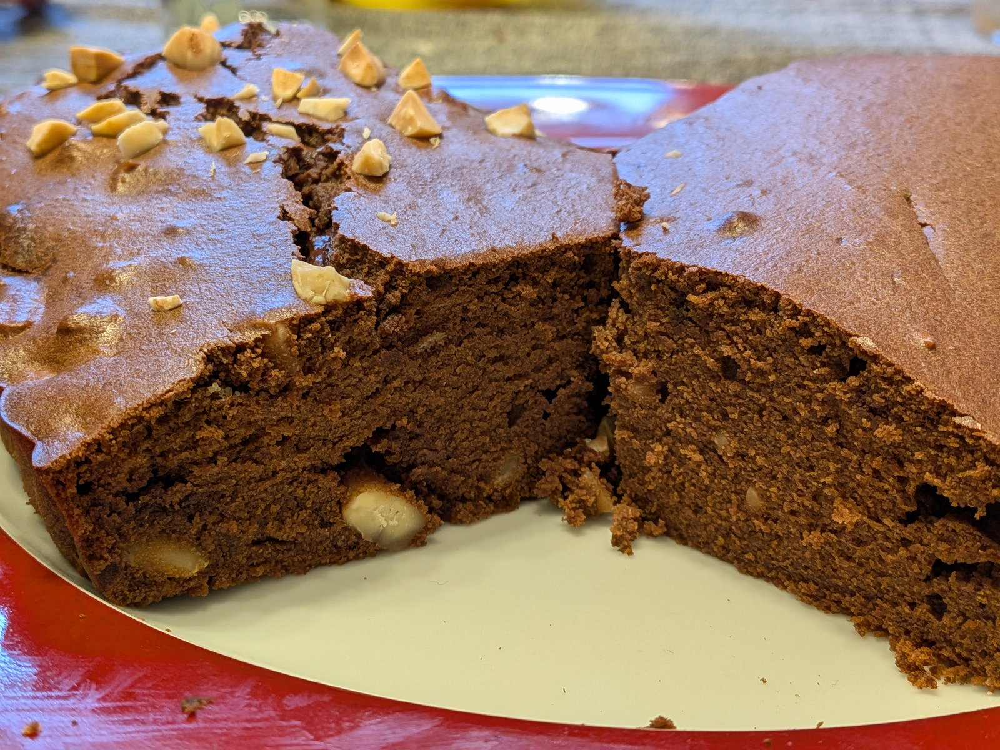

# Gâteau au chocolat sans gluten à la compote de pommes

Gâteau moelleux aéré, sans beurre ni sucre raffiné ajouté (hors sucre vanillé éventuel). La compote apporte sucrosité naturelle et fibres. 4 oeufs et une farine généreuse donnent une mie type gâteau (non-brownie).

* 205 g chocolat noir corsé pâtissier Nestlé dessert 65% cacao
* 200 g compote de pommes sans sucre ajouté
* 140 g [mélange de farines patisserie](MixFarinesPatisserieSansGluten.md)
*   4 oeufs
*   1/2 sachet levure chimique
*   1 sachet sucre vanillé (optionnel, complète le chocolat et donne un petit coup de pouce sucré)
*   1 g cannelle (optionnel, met en valeur la pomme)
*   2 g de sel
*  30 g d'amandes en poudre (optionnel, apporte gras et douceur, fibres et protéines)
*  80 g d'amandes concassées (optionnel, croquant et gourmand)

# Préparation

1. Préchauffer le four à 170°C.
2. Casser le chocolat en morceaux dans un bol, ajouter la compote, et faire
   chauffer au micro-ondes par tranches de 30 s en remuant à chaque fois,
   jusqu'à ce que le chocolat soit complètement fondu et le mélange lisse.
   Laisser tiédir.
3. Incorporer les oeufs à la base chocolat tiédie.
4. Ajouter les ingrédients secs progressivement : farine, sucre vanillé, cannelle, sel, amandes en poudre, en terminant par la levure chimique.
   Mélanger juste assez pour qu'il n'y ait pas de grumeaux.
5. Ajouter les amandes concassées, en garder quelques unes pour la décoration.
6. Verser dans un moule silicone.
7. Déposer quelques amandes concassées en surface.

# Cuisson

* 26 minutes à 170°C.
* Plonger un couteau pour vérifier que le coeur est cuit, légèrement humide mais non liquide.
* Laisser tiédir dans le moule avant démoulage, la mie se raffermit.

# Analyse nutritionnelle pour 100 g

Gâteau cuit, recette complète (amandes, sucre vanillé, cannelle).

* Énergie : 328 kcal
* Matières grasses : 20,0 g
  * dont acides gras saturés : 7,6 g
* Glucides : 26,5 g
  * dont sucres : 11,8 g
* Fibres : 5,5 g
* Protéines : 9,3 g
* Sel : 0,44 g

# Notes

* Premier essai 22 min / 180°C → trop peu cuit en quelques endroits centre.
  La compote (200 g) apporte beaucoup d'eau.
  Second essai 30 min / 170°C → trop cuit, un peu sec, surface légèrement brunie.
* Sans huile ni beurre : les graisses viennent du chocolat (~ 60 g de beurre
  de cacao), des 4 jaunes d'oeufs (~ 20 g) et des amandes en poudre le cas
  échéant. La compote compense en hydratation mais pas en gras, donc bien
  respecter la cuisson pour ne pas dessécher.
* Levure chimique nécessaire sans blancs en neige pour aérer la pâte. Le
  bicarbonate (~ 3 g) fonctionne aussi et réagit avec l'acidité de la compote.
