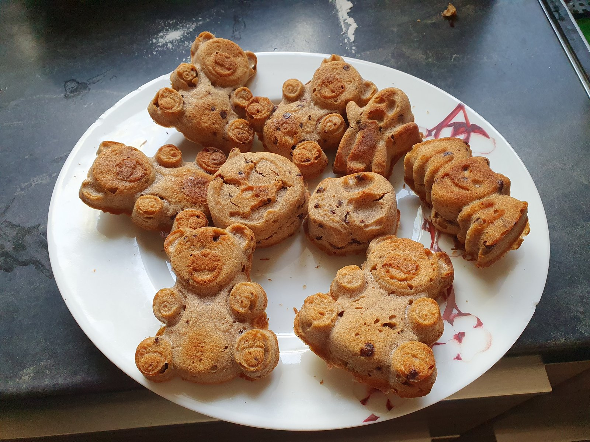

# Muffins aux pépites de chocolat sans gluten

Recette des [muffins aux pépites de chocolat de Marmiton](https://www.marmiton.org/recettes/recette_muffins-aux-pepites-de-chocolat_20636.aspx), ajustée de 12 à 15 muffins. La farine est remplacée à poids égal par le mélange sans gluten du dépôt et les 2,5 œufs obtenus par multiplication sont arrondis à 3 œufs entiers.

## Ingrédients (pour 15 muffins)

* 125 g de pépites de chocolat
* 375 g de [mélange de farines pour pâtisserie](MixFarinesPatisserie.md)
* 1 c. à café et 1/4 de levure chimique, soit environ 5 g
* 156 g de beurre
* un peu de beurre pour les moules, si nécessaire
* 150 g de cassonade ou de sucre blanc
* 3 œufs
* 250 mL de lait entier

## Préparation

1. Préchauffer le four à 200°C.
2. Faire fondre doucement le beurre dans une casserole à fond épais.
3. Mélanger le mélange de farines, la cassonade et la levure chimique.
4. Battre les œufs avec le lait.
5. Verser le mélange lait et œufs sur les ingrédients secs, puis bien mélanger.
6. Incorporer le beurre fondu.
7. Lorsque la pâte est lisse et sans grumeaux, ajouter les pépites de chocolat et mélanger.
8. Répartir la pâte dans 15 moules à muffins. Le beurrage est facultatif pour des moules en métal et inutile avec des moules en silicone.

## Cuisson

* Cuire 20 minutes à 200°C, un peu plus si nécessaire. Les muffins doivent être bien dorés.
* Les laisser tiédir avant de les démouler.

## Analyse nutritionnelle pour 100 g

Muffins cuits, calculés avec le mélange de farines sans gluten, des pépites de chocolat noir, de la cassonade et du lait entier. Le beurre éventuel des moules n'est pas compté. Hypothèse : 10 % d'eau évaporée à la cuisson, soit une masse cuite estimée à 1 090 g.

* Énergie : 372 kcal
* Matières grasses : **17,6** g
  * dont acides gras saturés : **10,3** g
* Glucides : **48,3** g
  * dont sucres : **21,7** g
* Fibres : **2,2** g
* Protéines : **5,4** g
* Sel : **0,20** g

## Notes

* Les quantités de la recette source ont été multipliées par 1,25 pour passer de 12 à 15 muffins. Seul le nombre d'œufs déroge à ce calcul : 3 œufs entiers remplacent les 2,5 œufs théoriques.
* Le paquet de 125 g de pépites est utilisé en entier.
* Cette recette reprend volontairement le beurre et le sucre de la recette source. Elle ne suit donc pas les objectifs habituels du dépôt concernant le sucre raffiné, les graisses saturées et les protéines.
