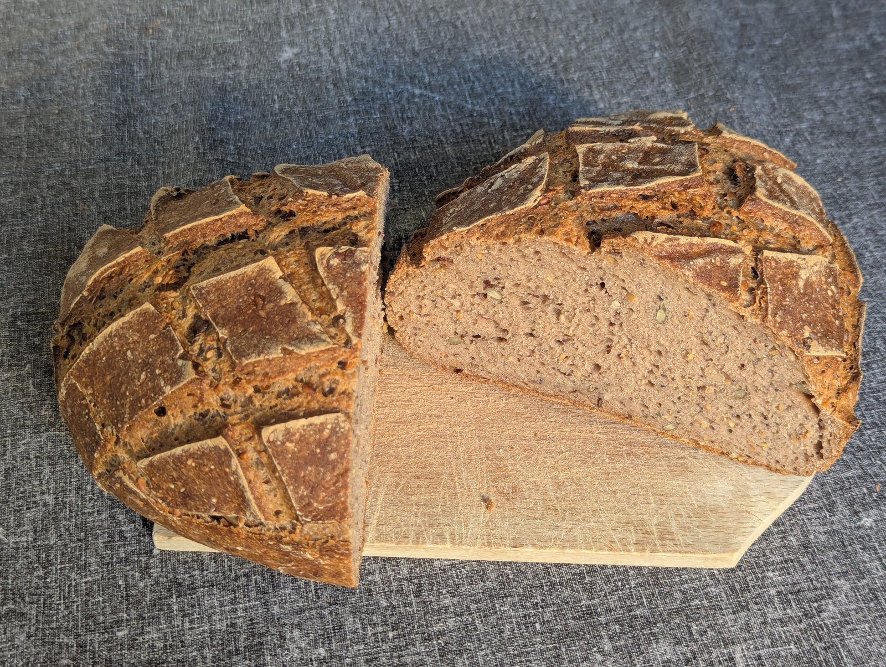
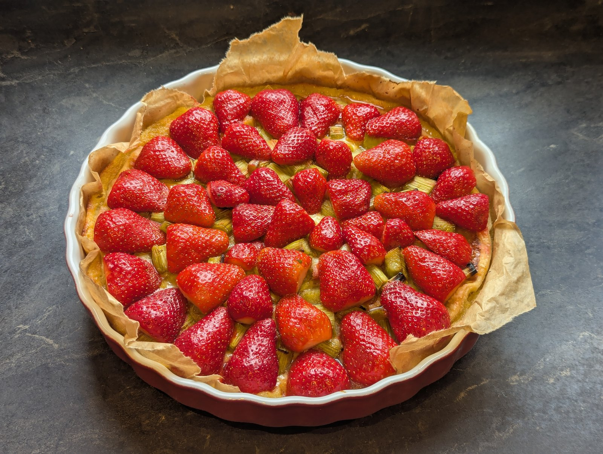

# Recettes sans gluten

Mélanges de farines, pains, pâtisseries et autres recettes sans gluten, avec
analyse nutritionnelle pour 100 g sur chaque recette.



## Site web

Les recettes sont publiées en ligne pour une consultation simple depuis un
smartphone en cuisine :

**https://srombauts.github.io/recettes-sans-gluten/**

Le site est généré avec [Jekyll](https://jekyllrb.com/) et le thème
[Just the Docs](https://just-the-docs.com/), avec :

- une barre latérale de navigation par catégorie ;
- une recherche plein texte ;
- une présentation lisible sur mobile.

Le déploiement est automatique via GitHub Actions à chaque push sur `master`
(voir [`.github/workflows/pages.yml`](.github/workflows/pages.yml)).

## Sections

- [Pain](Pain/) — pains au levain et à la levure, mix de farines.
- [Levain](Levain/) — entretien et rafraîchi du levain chef.
- [Pâtisserie](Patisserie/) — brownies, gâteaux, variantes protéinées.
- [Autres](Autres/) — pâtes à tartiner et autres préparations.
- [Notes](Notes/) — fiches transversales (protéines, fibres).
- [Prix des ingrédients](PrixIngredients.md) — table de référence.

## Quelques recettes en images

[Gâteau au chocolat sans gluten à la compote](Patisserie/GateauChocolatSansGlutenCompote.md) — moelleux, sans beurre ni sucre raffiné, parsemé d'amandes concassées :


[Tarte à la rhubarbe au Skyr et compote](Patisserie/TarteRhubarbeSkyrCompote.md) — garniture sans sucre raffiné, ici décorée de fraises fraîches :



## Objectifs des recettes

Par ordre de priorité décroissante :

1. Goût agréable, doux mais riche, subtil.
2. Texture, consistance, légèreté, aération.
3. Augmenter les taux de protéines pour un indice glycémique modéré
   (prévention du diabète de type 2) et soutenir l'activité physique.
4. Limiter les graisses saturées (prévention du cholestérol).
5. Prix contenu.

## Développement local du site

Prérequis : Ruby 3.x et Bundler.

```bash
bundle install
bundle exec jekyll serve --livereload
```

Le site est ensuite accessible sur http://localhost:4000.
